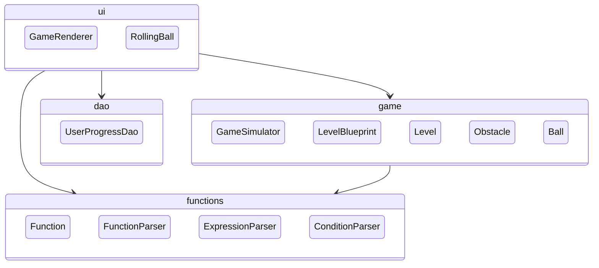
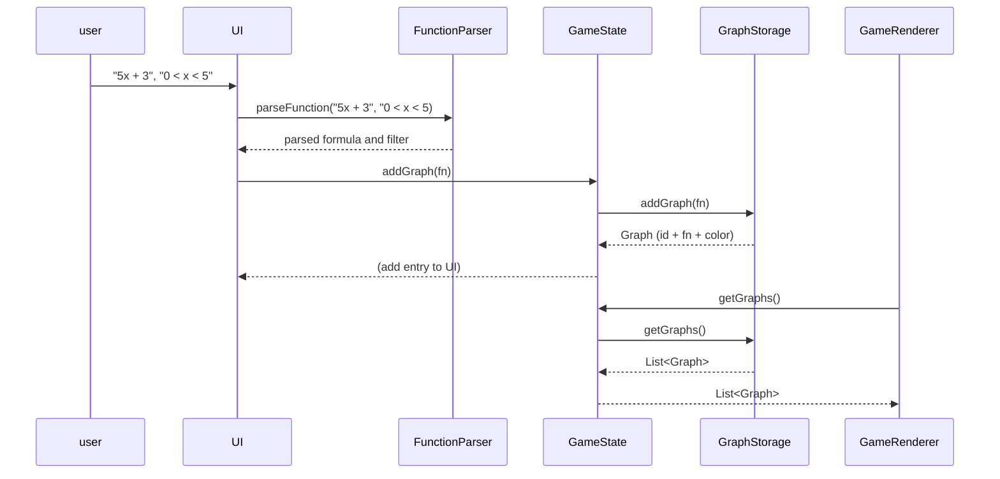
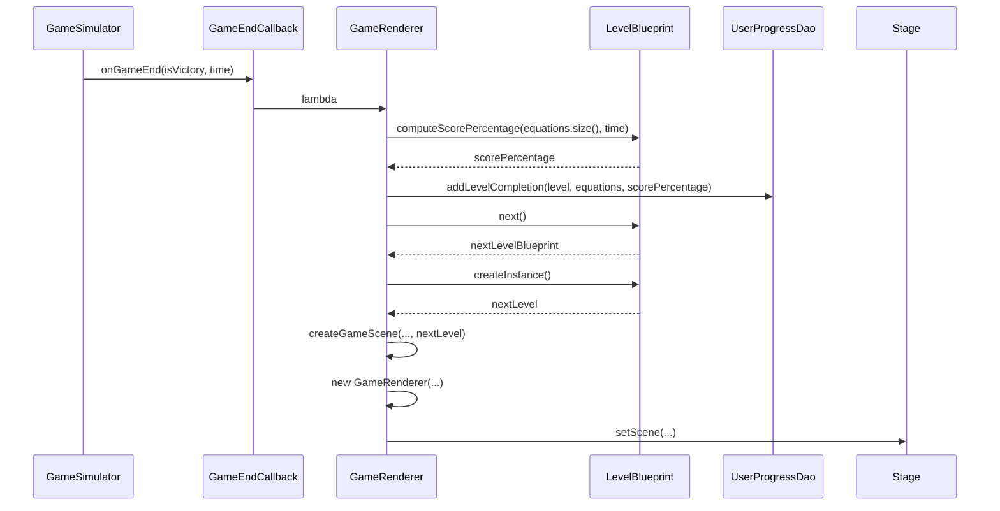

# Arkkitehtuurikuvaus

Ohjelman rakenne on pääosin hierarkkinen. Käyttöliittymäluokat paketissa `ui` käyttävät `functions`-, `game`- ja `dao` -paketteja, ja `game` käyttää `functions`-pakettia. `functions`- ja `dao`-paketit eivät tiedä muista paketeista. Seuraava diagrammi kuvaa ohjelman kunkin paketin oleellisimpia (muttei kaikkia) luokkia, ja pakettien välisiä suhteita:

Sovelluksen sydän on luokat [GameSimulator.java] ja käyttöliittymäluokka [GameRenderer.java]. 

`GameSimulator` sisältää kaiken ajonaikaisen datan/tilan ja sisältää logiikan pallon liikkumiselle.
Luokassa on `FunctionStorage`-objekti, joka sisältää tiedon kaikista käyttäjän syöttämistä yhtälöistä ja niihin liittyvästä datasta, kuten väristä. Yhtälö itsessään on `functions`-paketin `Function`-tyyppiä, joka sisältää sekä yhtälön että mahdollisen rajauksen.
`GameSimulator` on kenttäkohtainen: aina, kun pelaaja vaihtaa kenttää, luodaan uusi GameSimulator-objekti, joka ei tiedä aiemmista mitään. Vanhaa ei säilytetä. 

`GameRenderer` puolestaan ei sisällä sovelluslogiikkaa tai dataa: luokan ainoa tehtävä on piirtää pelitilanne ruudulle, ja vastaanottaa käyttäjän syötteitä. Luokka kommunikoi käyttäjän syötteet pääasiassa suoraan `GameSimulator`-objektille, joka syötteen tyypistä riippuen kutsuu `FunctionStorage`a, tai mahdollisesti käynnistää/lopettaa simulaation. 

Pelin päättyessä (voittoon tai häviöön) `GameSimulator` ilmoittaa asiasta hallinnoivalle luokalle, eli käytännössä `GameRenderer`-objektille, vaikka `GameSimulator` ei asiaa tiedäkään.

## Luokkakaavio

Seuraava luokkakaavio kuvaa projektin keskeisten luokkien suhteita toisiinsa:

## Toiminnallisuus

Sovelluksen käyttöliittymä on melko yksinkertainen, eikä ole montaa asiaa, mitä käyttäjä voi tehdä. Tärkein on yhtälön syöttäminen ohjelmaan ja yhtälön piirtäminen, mikä näyttää karkeasti seuraavalta:

Toinen keskeinen tapahtuma on, kun pelaaja saa vietyä pallohahmon maalilipulle ja kenttä merkitään suoritetuksi. Tällöin lisätään tieto suorituksesta UserProgressDao:n kautta pysyväistallennukseen, ja luodaan ja siirrytään seuraavaan kenttään. Tämä tapahtuu seuraavasti:

## Käyttöliittymä

Peli koostuu kolmesta eri näkymästä: päävalikko, kenttävalikko ja pelinäkymä. Jokainen näkymä on oma Scene-olionsa, ja vain yksi on kerrallaan näkyvissä. Käyttöliittymä on täysin eristetty pakkaukseen `rollingball.ui`, mutta käyttöliittymäkoodi käytännössä hallinnoi koodia kutsumalla projektin muita luokkia.

## Tietojen tallennus

Peli tallentaa käyttäjän edistymisen `rollingballdata.dat`-tiedostoon, jota hallinnoi koodissa Data Access Object (DAO) -mallia mukailevat UserProgressDao- ja FileUserProgressDao-luokat. Tiedosto luetaan kerran sovelluksen käynnistyessä, ja muutokset tallennetaan sovellusta suljettaessa. Muulloin tiedot pidetään välimuistissa, jotta niiden lukeminen ja muokkaaminen on nopeaa ja helppoa.

`rollingballdata.dat`-tiedosto luodaan samaan kansioon, jossa sovellus käynnistetään.
