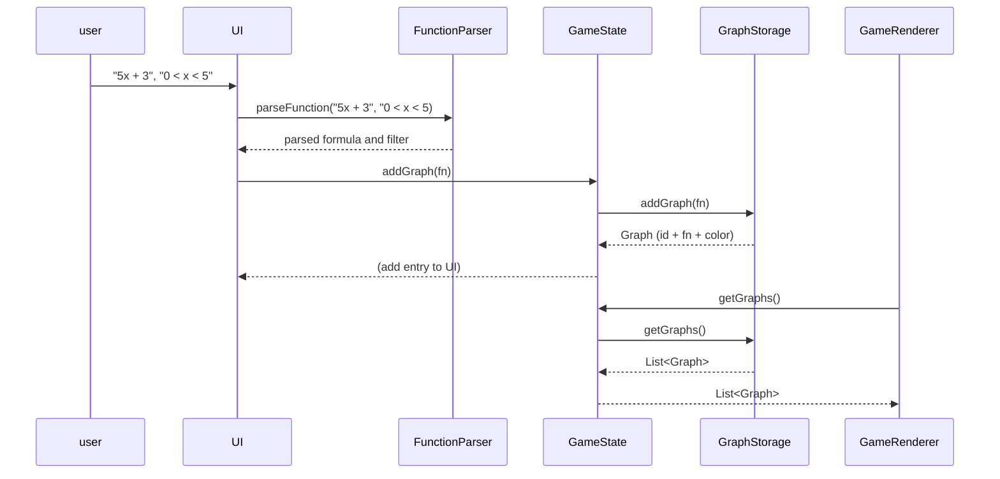

# Arkkitehtuurikuvaus

Ohjelman rakenne on hierarkkinen: käyttöliittymäluokat (erityisesti GameRenderer.java ja GraphStorage.java) käyttävät `expressions` ja `dao` -paketteja, jotka eivät tiedä toisistaan.

Käyttöliittymää lukuunottamatta ohjelman keskeisiä luokkia ovat `expressions`-paketin rajapinta `Expr`, jonka avulla kaikki matemaattiset yhtälöt esitetään koodissa. 

GraphStorage on pelinaikainen säilöntäpaikka käyttäjän syöttämille yhtälöille. 

`ui`-paketin `GameRenderer.java` luo ja käyttelee GraphStoragea ja säilöttyjä `Expr`-olioita. `expressions`-paketin `ExpressionParser` luo kaikki ohjelman `Expr`-oliot.

## Toiminnallisuus

Sovelluksen käyttöliittymä on melko yksinkertainen, eikä ole montaa asiaa, mitä käyttäjä voi tehdä. Tärkein on yhtälön syöttäminen ohjelmaan ja yhtälön piirtäminen, mikä näyttää karkeasti seuraavalta:

## Käyttöliittymä

Peli koostuu kolmesta eri näkymästä: päävalikko, kenttävalikko ja pelinäkymä. Jokainen näkymä on oma Scene-olionsa, ja vain yksi on kerrallaan näkyvissä. Käyttöliittymä on täysin eristetty pakkaukseen `rollingball.ui`, mutta käyttöliittymäkoodi käytännössä hallinnoi koodia kutsumalla projektin muita luokkia.

## Tietojen tallennus

Peli tallentaa käyttäjän edistymisen `rollingballdata.dat`-tiedostoon, jota hallinnoi koodissa Data Access Object (DAO) -mallia mukailevat UserProgressDao- ja FileUserProgressDao-luokat. Tiedosto luetaan kerran sovelluksen käynnistyessä, ja muutokset tallennetaan sovellusta suljettaessa. Muulloin tiedot pidetään välimuistissa, jotta niiden lukeminen ja muokkaaminen on nopeaa ja helppoa.

`rollingballdata.dat`-tiedosto luodaan samaan kansioon, jossa sovellus käynnistetään.
