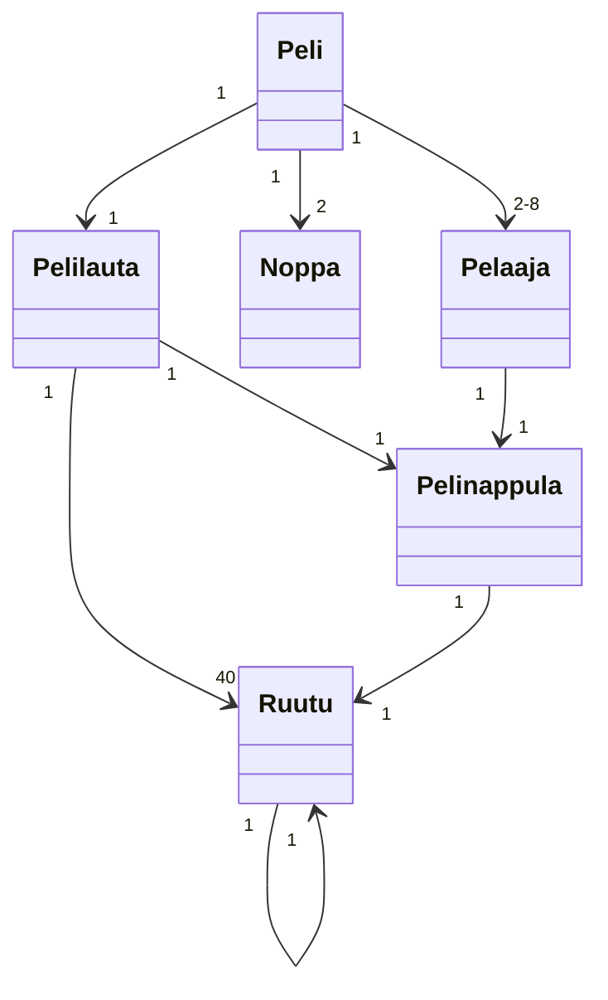
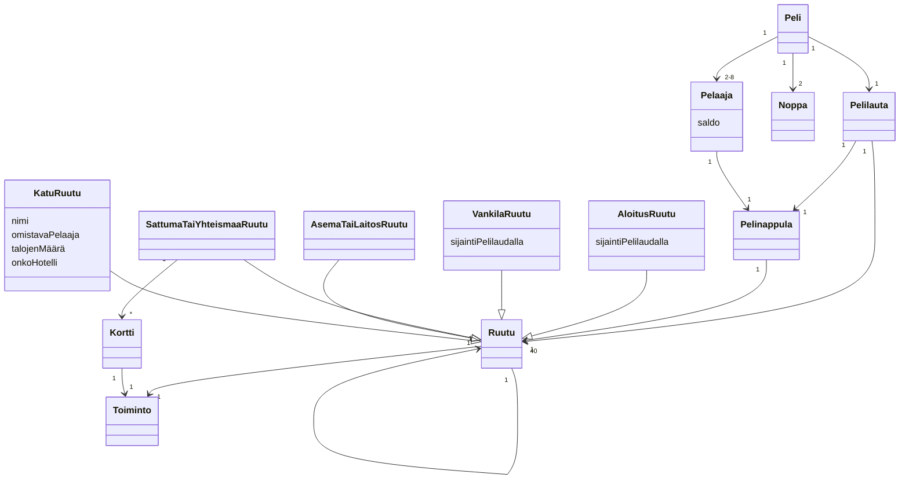
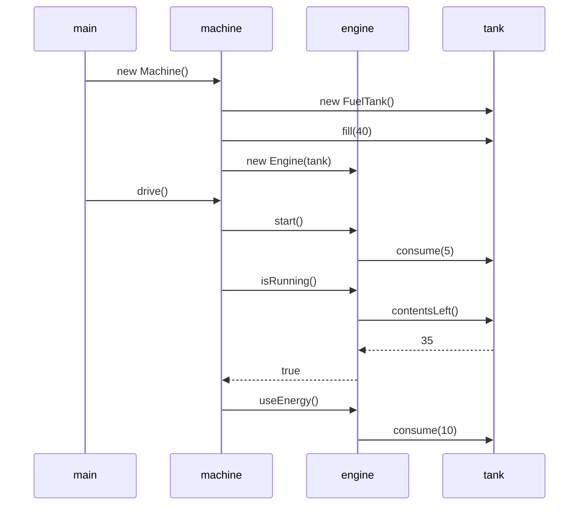
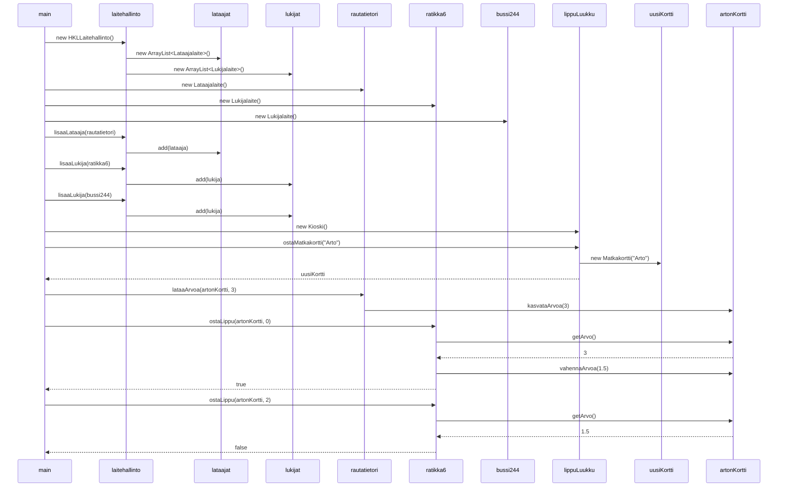

1.

```mermaid
classDiagram
      Peli "1" --> "2-8" Pelaaja
      Peli "1" --> "2" Noppa
      Peli "1" --> "1" Pelilauta
      Pelilauta "1" --> "40" Ruutu
      Pelilauta "1" --> "1" Pelinappula
      Pelinappula "1" --> "1" Ruutu
      Ruutu "1" --> "1" Ruutu
      Pelaaja "1" --> "1" Pelinappula
      class Peli {
      }
      class Pelaaja {
      }
      class Noppa {
      }
      class Pelilauta {
      }
      class Ruutu {
      }
```

2.

```mermaid
classDiagram
      Peli "1" --> "2-8" Pelaaja
      Peli "1" --> "2" Noppa
      Peli "1" --> "1" Pelilauta
      Pelilauta "1" --> "40" Ruutu
      Pelilauta "1" --> "1" Pelinappula
      Pelinappula "1" --> "1" Ruutu
      Ruutu "1" --> "1" Ruutu
      Pelaaja "1" --> "1" Pelinappula
      class Peli
      class Pelaaja {
        saldo
      }
      class Noppa
      class Pelilauta
      class Ruutu
      AloitusRuutu --|> Ruutu
      VankilaRuutu --|> Ruutu
      SattumaTaiYhteismaaRuutu --|> Ruutu
      AsemaTaiLaitosRuutu --|> Ruutu
      KatuRuutu --|> Ruutu
      class AloitusRuutu{
        sijaintiPelilaudalla
      }
      class VankilaRuutu {
        sijaintiPelilaudalla
      }
      class SattumaTaiYhteismaaRuutu
      class AsemaTaiLaitosRuutu
      class KatuRuutu {
        nimi
        omistavaPelaaja
        talojenMäärä
        onkoHotelli
      }
      
      class Toiminto
      Ruutu "1" --> "1" Toiminto
      
      class Kortti
      Kortti "1" --> "1" Toiminto
      SattumaTaiYhteismaaRuutu "1" --> "*" Kortti 
```
Tämän spagetin jälkeen viimeistään en enää usko, että olen kaiken ymmärtänyt oikein... mutta pitäisi nähdäkseni täyttää tehtävänannon vaatimukset?

3.

```mermaid
sequenceDiagram
   participant main
   participant machine
   participant engine
   participant tank
   main ->> machine: new Machine()
   machine ->> tank: new FuelTank()
   machine ->> tank: fill(40)
   machine ->> engine: new Engine(tank)
   main ->> machine: drive()
   machine ->> engine: start()
   engine ->> tank: consume(5)
   machine ->> engine: isRunning()
   engine ->> tank: contentsLeft()
   tank -->> engine: 35
   engine -->> machine: true
   machine ->> engine: useEnergy()
   engine ->> tank: consume(10)
```

```mermaid
sequenceDiagram
   main ->> laitehallinto: new HKLLaitehallinto()
   laitehallinto ->> lataajat: new ArrayList<Lataajalaite>()
   laitehallinto ->> lukijat: new ArrayList<Lukijalaite>()
   main ->> rautatietori: new Lataajalaite()
   main ->> ratikka6: new Lukijalaite()
   main ->> bussi244: new Lukijalaite()
   main ->> laitehallinto: lisaaLataaja(rautatietori)
   laitehallinto ->> lataajat: add(lataaja)
   main ->> laitehallinto: lisaaLukija(ratikka6)
   laitehallinto ->> lukijat: add(lukija)
   main ->> laitehallinto: lisaaLukija(bussi244)
   laitehallinto ->> lukijat: add(lukija)
   main ->> lippuLuukku: new Kioski()
   main ->> lippuLuukku: ostaMatkakortti("Arto")
   lippuLuukku ->> uusiKortti: new Matkakortti("Arto")
   lippuLuukku -->> main: uusiKortti
   main ->> rautatietori: lataaArvoa(artonKortti, 3)
   rautatietori ->> artonKortti: kasvataArvoa(3)
   main ->> ratikka6: ostaLippu(artonKortti, 0)
   ratikka6 ->> artonKortti: getArvo()
   artonKortti -->> ratikka6: 3
   ratikka6 ->> artonKortti: vahennaArvoa(1.5)
   ratikka6 -->> main: true
   main ->> ratikka6: ostaLippu(artonKortti, 2)
   ratikka6 ->> artonKortti: getArvo()
   artonKortti -->> ratikka6: 1.5
   ratikka6 -->> main: false
```
